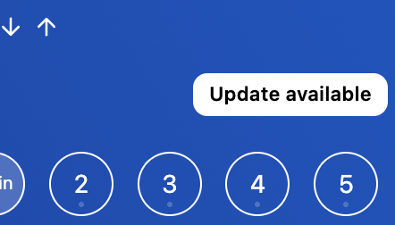
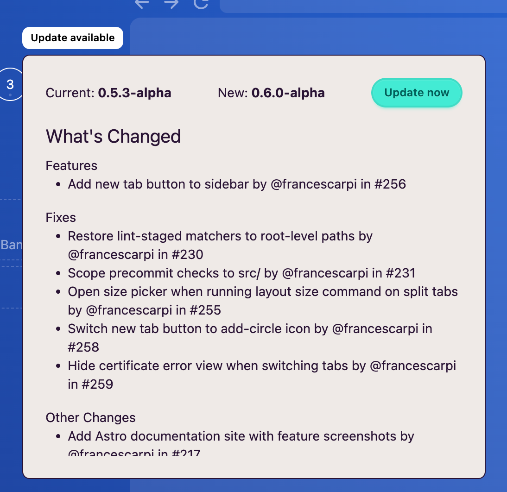
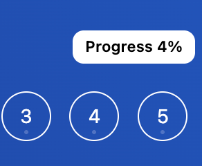
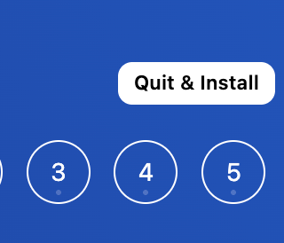

Quan hi hagi una nova actualització disponible, la veuràs indicada amb un botó sobre els escriptoris.

Al fer clic sobre el botó, t'apareixerà un modal amb les novetats de la versió.

:::note
Sempre és recomanable instal·lar l'última versió per a tenir la versió més estable i segura possible.
:::

Fes clic a **Update now** per a descarregar-la. El progrés de la descàrrega el veuràs també al mateix lloc:

Quan hagi acabat la descàrrega, veuràs el botó de **Quit & Install** per a procedir amb la instal·lació.

