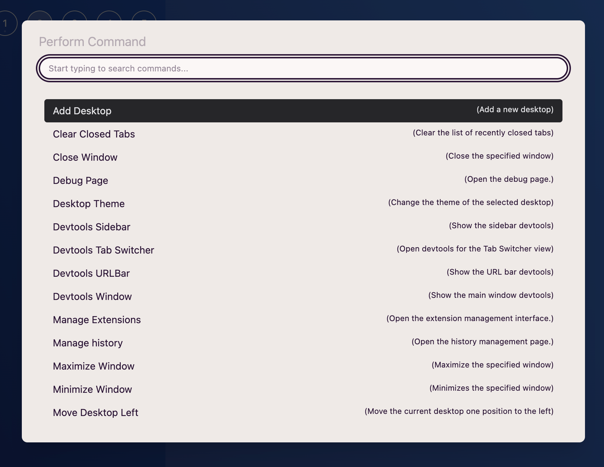

import FeatureAccess from '../../../components/FeatureAccess.astro'

**AwesomeB** ofereix a l'usuari una interfície de comandes per a utilitzar qualsevol de les funcionalitats disponibles d'una manera més ràpida i directa.

<FeatureAccess entity="comandes" menu={['File', 'Perform Command']} macOS="Cmd+p"/>

També pots accedir-hi fent clic aquí:

Quan activis el disparador de comandes, veuràs una finestra modal amb un llistat extens de totes les funcionalitats que pots utilitzar. Pots:

1. Filtrar-les escrivint text.
2. `Shift+j` / `Shift+k` / `Arrow Up` / `Arrow Down`: per a navegar a l'anterior o següent.
3. **Enter**: seleccionar o executar.

