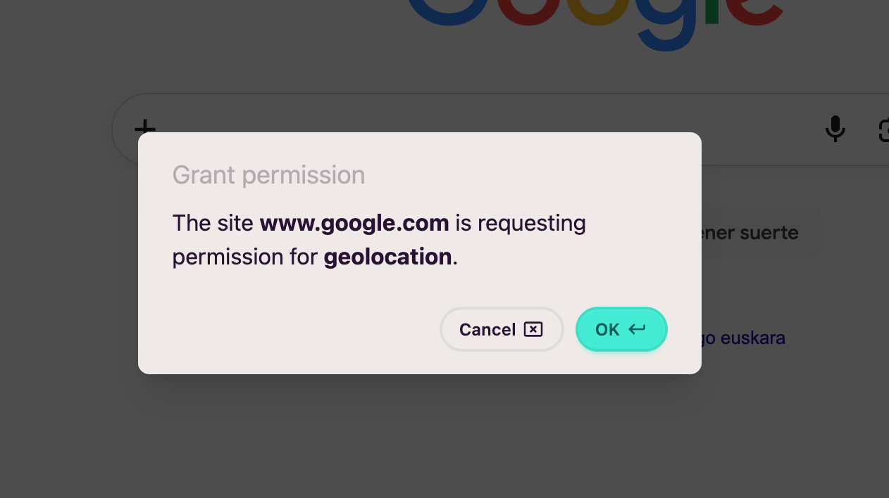
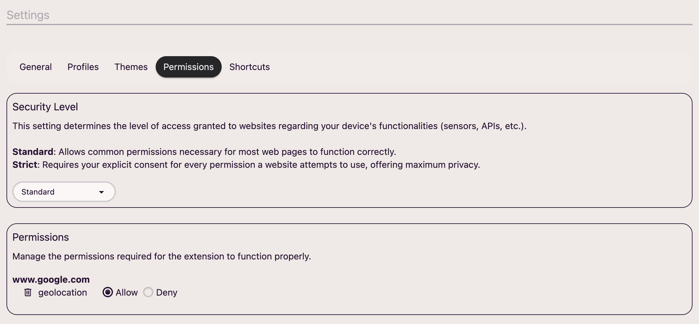

Molts llocs web necessiten permisos per a poder operar correctament, per exemple per a utilitzar el `localStorage` o la geolocalització, etc.

Quan un lloc web demani autorització per a utilitzar un permís, veuràs un modal similar a aquest:

Des d'aquest apartat de la configuració podràs gestionar els permisos dels llocs web i el nivell de seguretat:

## Nivell de seguretat

Actualment hi ha dos nivells de seguretat:

* **Estàndard**: Per a no ser gaire pesat, no et demanarà permís per a alguns dels permisos més habituals. A continuació tens la llista:
  * Sensors
  * Acceleròmetre
  * Giroscopi
  * Magnetòmetre
  * Sensor de llum ambient
  * Escriure i llegir des del portapapers
  * Passar a mode de pantalla sencera
  * Auto-reproduir un vídeo
* **Estricte**: El mode estricte et demanarà autorització per a tots els permisos.

## Gestionar permisos

Des d'aquest apartat podràs modificar el valor de qualsevol permís d'un lloc web o, fins i tot, esborrar-los tots.
