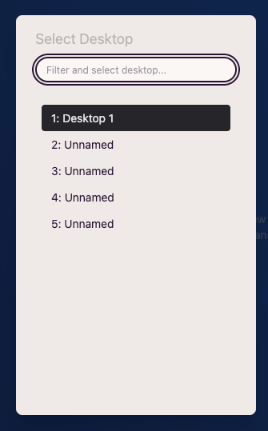

import FeatureAccess from '../../../../components/FeatureAccess.astro'

Per a accedir a un escriptori concret, com que estan numerats, ho pots fer amb:

<FeatureAccess entity="accedir al primer escriptori" shortcut="selectDesktop1" />

<FeatureAccess entity="accedir al segon escriptori" shortcut="selectDesktop2" />

... i així fins a l'últim.

## Anterior/Següent

Si et vols moure entre els escriptoris:

<FeatureAccess entity="escriptori anterior" shortcut="previousDesktop" command="previousDesktop" />

<FeatureAccess entity="escriptori següent" shortcut="nextDesktop" command="nextDesktop" />

## Cercar un escriptori

Amb la següent drecera t'apareix un modal amb tots els escriptoris:

<FeatureAccess entity="cercar un escriptori" shortcut="findDesktop" />

