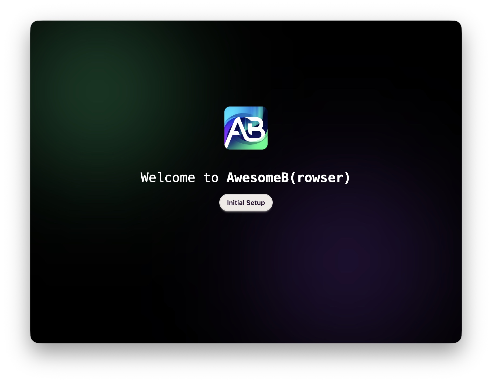
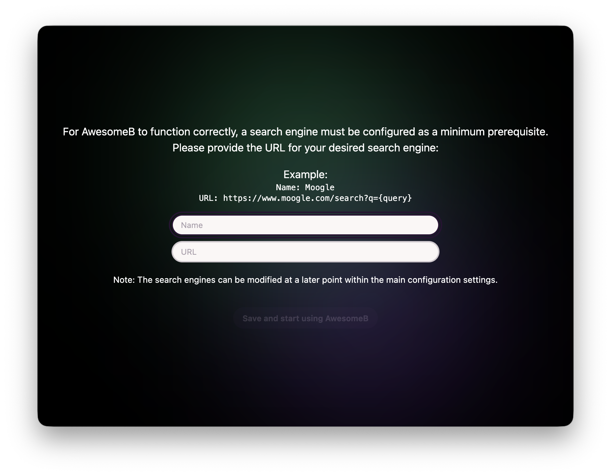

Quan iniciïs **AwesomeB** per primera vegada, el que veuràs és una vista de benvinguda com aquesta:

Prem **Initial Setup** per omplir la configuració mínima necessària perquè **AwesomeB** pugui funcionar.

El primer que cal fer és configurar com a mínim un cercador, com el que surt a l'exemple:

* Nom: Moogle
* URL: https://moogle.com/search?q={query}

:::note
Actualment no hi ha cap cercador predefinit: n'has de configurar un manualment.

És probable que en el futur se n'afegeixin de gratuïts, i els d'empreses patrocinadores podrien incloure's per defecte.
:::

Un cop configurat el primer cercador, podràs iniciar el navegador amb normalitat.

:::note
Si vols configurar més cercadors, podràs fer-ho a través de la pàgina de configuració.
:::
