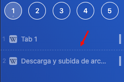

Els separadors tan sols són un element visual (línia discontínua) que separa una *tab container* d'una altra. Són útils quan en tens moltes i les vols separar per context.

A través del **menú contextual** pots:

* Afegir una divisió
* Esborrar una divisió
* Esborrar totes les divisions que hi ha a l'escriptori.

També tens disponibles les comandes:
* Add Tab Container Divider
* Remove All Desktop Dividers
* Remove Tab Container Divider
