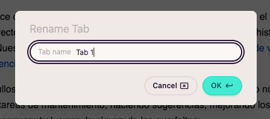
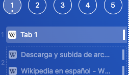

import FeatureAccess from '../../../../components/FeatureAccess.astro'

<FeatureAccess entity="renombrar" command="Rename Tab" contextMenu="Rename" />

Aquesta és una funcionalitat molt útil quan vols canviar el títol del lloc web per un de personalitzat. El nom personalitzat prevaldrà sobre el títol original.

El nou nom serà visible a tot arreu: *sidebar*, llistat de pestanyes, etc.

