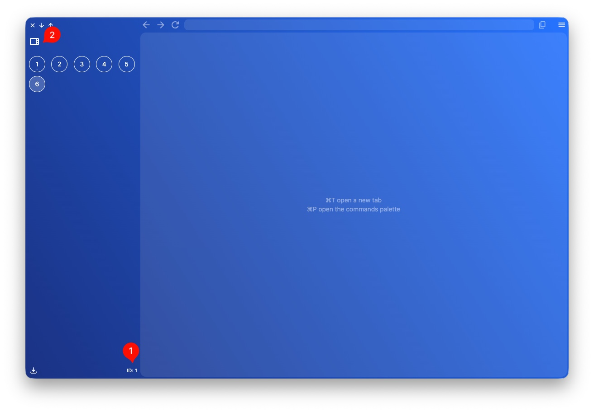
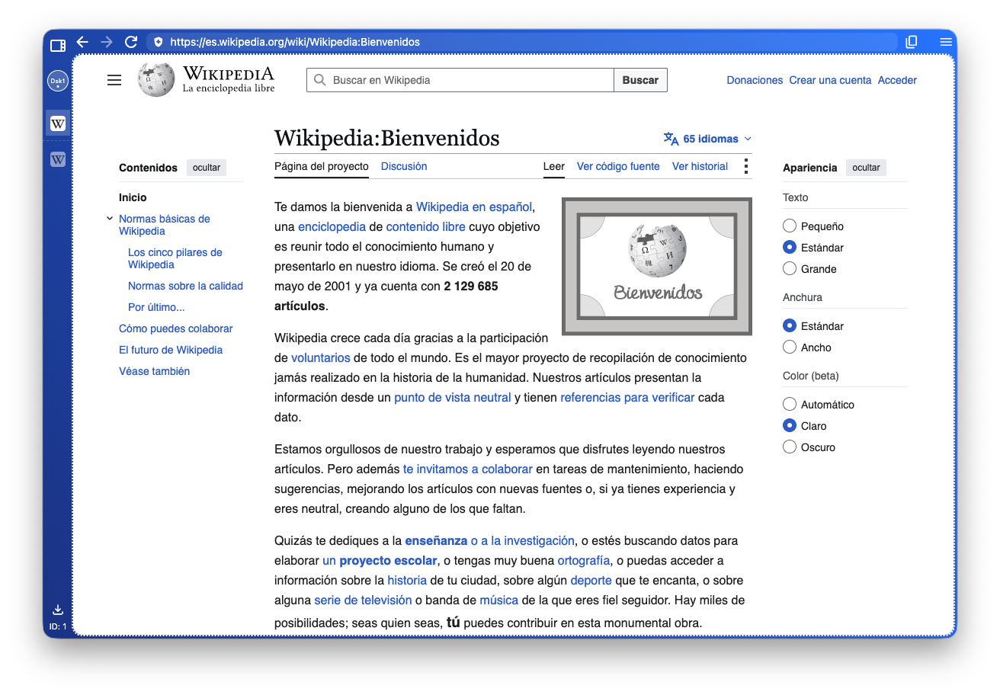
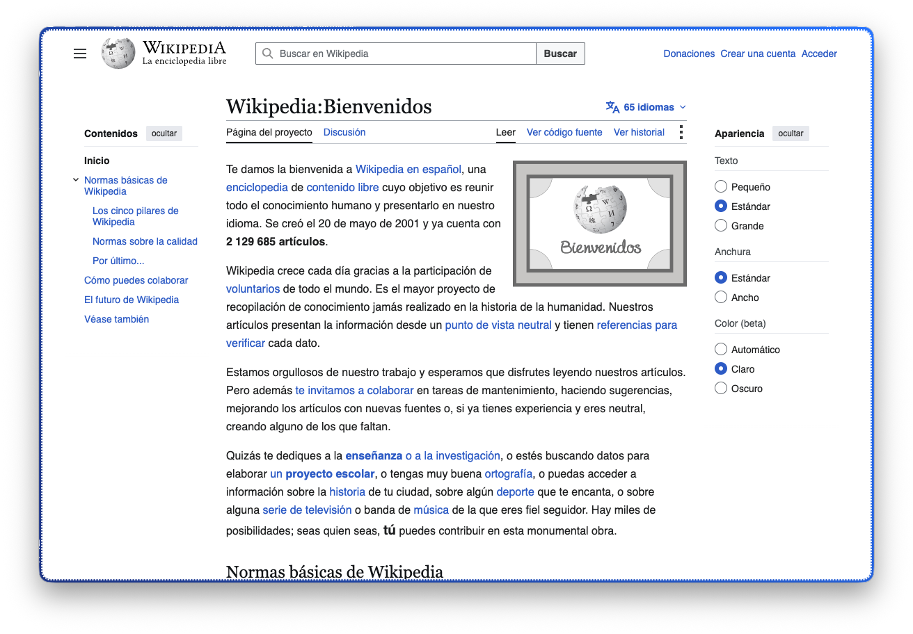

import FeatureAccess from '../../../../components/FeatureAccess.astro'

Una finestra està identificada amb un número (1). Així, si mous una pestanya a una altra finestra, pots identificar-la millor.

## Colapsar panell esquerre (sidebar)

<FeatureAccess entity="col·lapsar el panell esquerre" macOS="Cmd+s" command="toggleSidebar"/>

També pots fer-ho fent clic al botó de col·lapsar (2).

## Maximitzar àrea

<FeatureAccess entity="maximitzar un lloc web" macOS="Cmd+i" command="toggleMaximizeArea"/>

És útil quan vols que el lloc web ocupi tot l'espai disponible.

