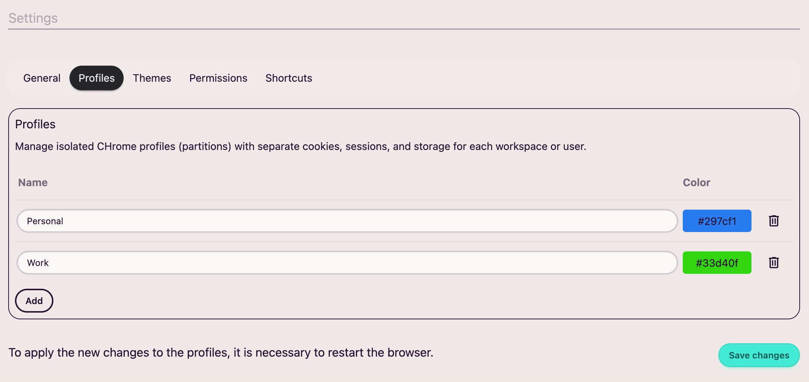

Profiles are **containers** for browsing isolation: each profile keeps its own cookies, cache, and session data, so you can have separate contexts (work, personal, testing) in the same browser without them mixing.

By default, **AwesomeB** ships with two:

* **Default**
* **Private**: Runs exclusively in memory. It does not persist cookies, cache, or any browsing data to disk: when you close the session, everything is wiped. Designed for shared computers, one-off operations with sensitive data, or browsing without leaving a trace.

From this settings section you can create additional profiles, such as a personal one or a work one.

For each profile you can define a **name** and a **color**.

:::note
Currently, adding or removing a profile requires restarting the browser.
:::
