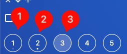

Desktops are a way to organize tabs (you could say they are like groups).

By default there are 5, but you can create up to 9.

They are numbered, the first being number 1 and the last number 9, but you can name them if you want.

Read the following sections to learn about all the features.

## Tab indicator

The desktop icon can have 3 states:

* No tabs (3)
* Has tabs, but all are inactive (1)
* Has tabs and at least one is active (2)

