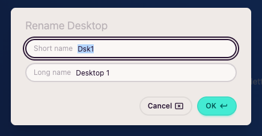
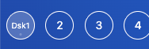

import FeatureAccess from '../../../components/FeatureAccess.astro'

<FeatureAccess entity="rename" command="Rename Desktop" contextMenu="Rename" />

You can assign a short and a long name to a desktop:

The short one is used in the *sidebar*:

...and the long one in other places where it can be displayed. For example, in the desktop selection modal:

