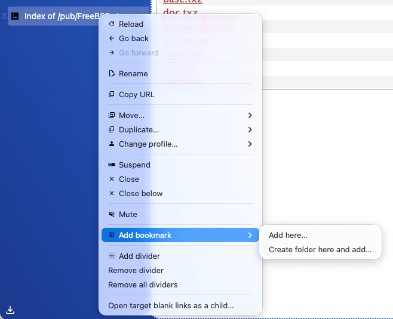
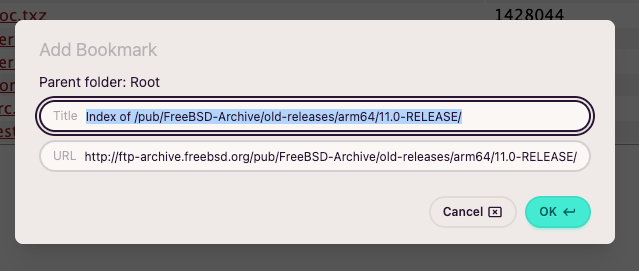
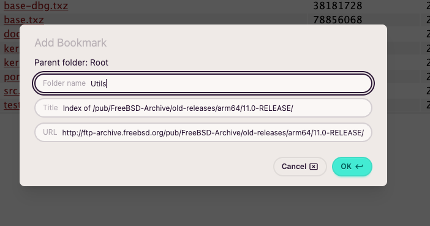
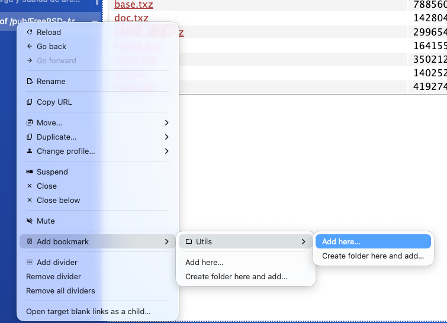
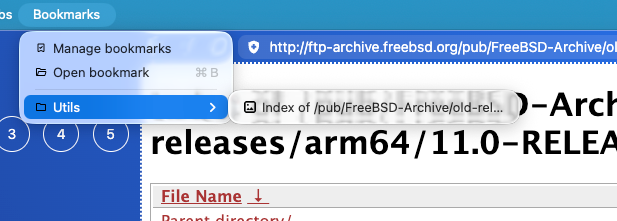
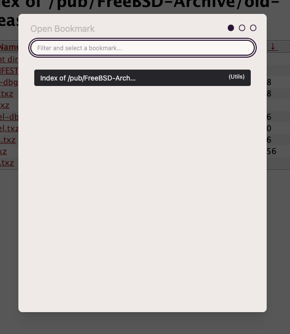
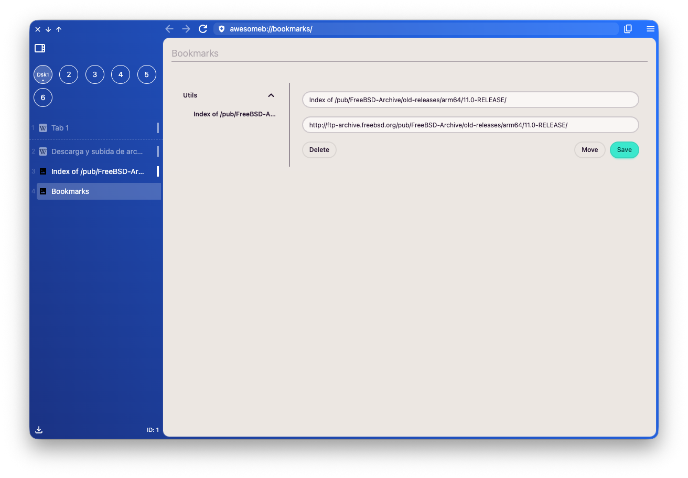

import FeatureAccess from '../../../components/FeatureAccess.astro'

Como en otros navegadores, la funcionalidad de favoritos te permite almacenar de forma estructurada sitios web para poder acceder a ellos en futuras ocasiones.

## Añadir un favorito

Solo es posible utilizando el menú contextual cuando una pestaña está activa:

### Añadir aquí

Te permite guardar el sitio web en la carpeta seleccionada. Inicialmente, como no hay ninguna, se guardan en el *root*.

### Crear carpeta y añadir

Te permite crear una nueva carpeta dentro de la carpeta donde estés (la primera vez es *root*) y guardar el sitio web directamente allí.

Con este ejemplo verás el porqué del *Add here...* y *Create folder here and add...*. Si vuelves a acceder a la opción de añadir favorito verás la nueva carpeta creada en el ejemplo, y el siguiente sitio web lo puedes guardar en *root* o dentro de *Utils* o las carpetas que tengas.

## Acceder a un favorito

### Desde el menú

La estructura de favoritos es accesible directamente desde el menú principal.

### Desde el buscador de favoritos

<FeatureAccess entity="buscar un favorito" shortcut="openBookmark" menu="bookmarks.open" />

## Gestionar favoritos

<FeatureAccess entity="gestionar favoritos" menu="bookmarks.manage" command="bookmarksManage" />

Actualmente hay una versión bastante minimalista de la página de gestión de favoritos. Te permite modificar, borrar y mover un favorito. Y poco más. Irá evolucionando.

