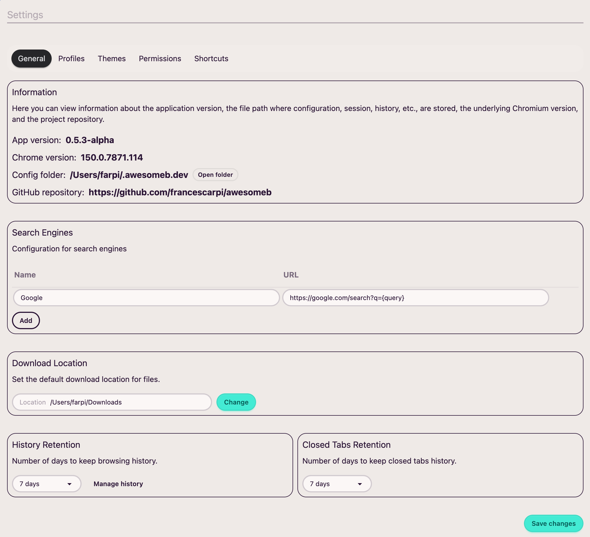

Puedes acceder a la configuración general a través de:

* **Menú principal**: AwesomeB → Preferencias
* **Atajo**:
  * macOS: `Cmd+,`

Aquí encontrarás diferentes apartados de configuración genérica.

## Información

Aquí encontrarás la versión de la aplicación, la de Chrome, la ruta de la carpeta de configuración de **AwesomeB** y la URL del repositorio.

:::note
Ten en cuenta que todos los archivos de configuración (sesiones, historial, marcadores, etc.) están en texto plano. Esto significa que puedes hacer copias de seguridad con tu sistema de control de versiones.
:::

## Motores de búsqueda

Como has visto en el apartado de [primeros pasos](/es/firststeps), hay que configurar un primer motor de búsqueda al iniciar el navegador por primera vez.

Desde aquí podrás añadir más, editarlos o borrarlos.

## Carpeta de descargas

Permite configurar la carpeta donde el navegador dejará las descargas.

## Retención del historial

Permite indicar durante cuántos días quieres que se guarde el historial de navegación. También hay un enlace a la vista del historial.

## Retención de las pestañas cerradas

Cuando se cierra una pestaña, **AwesomeB** lo hace de forma *virtual*. En realidad, permanece ahí de forma oculta durante unos días (por si quieres recuperarla). Desde aquí puedes indicar durante cuántos días quieres que se mantengan las pestañas cerradas.
