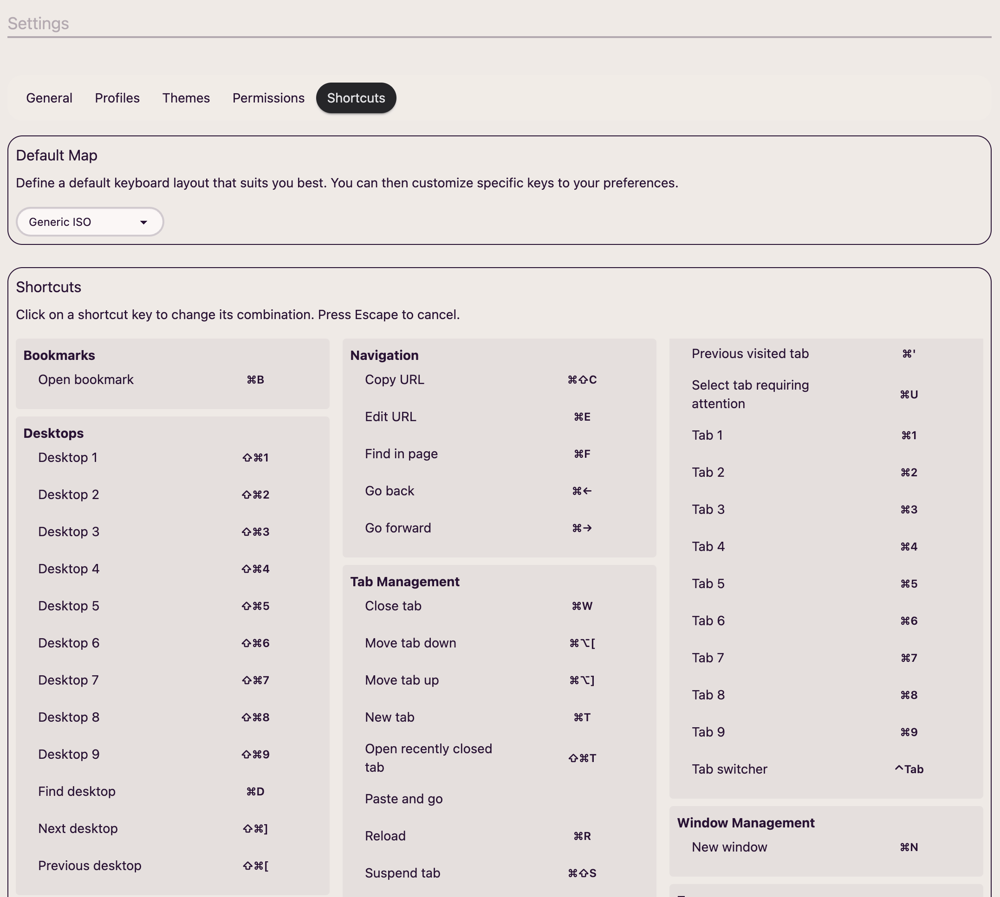
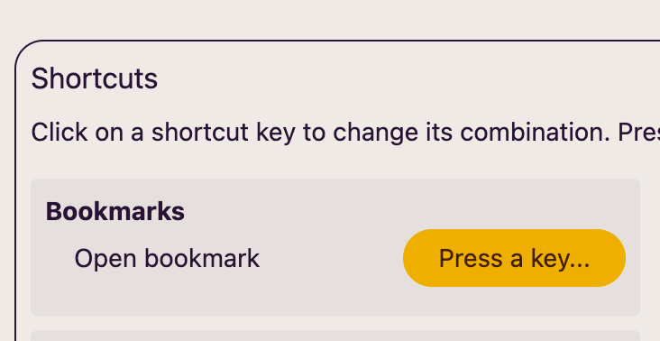

Aquí es donde puedes personalizar los atajos para que te sientas lo más cómodo posible al usar **AwesomeB**.

Lo primero que puedes hacer es definir el mapa de teclado por defecto. Actualmente solo hay uno, **Generic ISO**, pero la intención es ir añadiendo más en un futuro, por ejemplo **Generic ANSI**.

Una vez elegido el mapa que mejor se ajusta a tu tipo de teclado, puedes incluso personalizar cada atajo haciendo clic encima y estableciendo el nuevo atajo:

