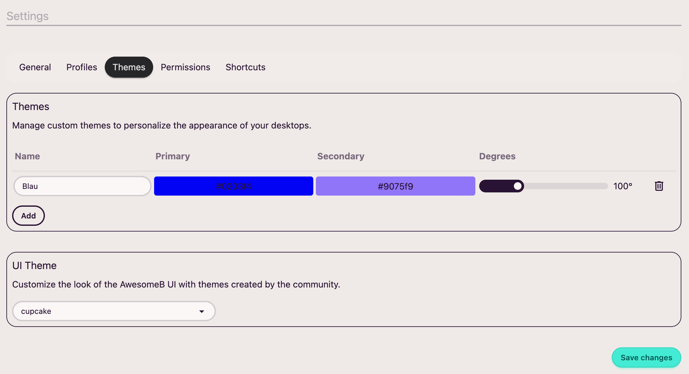

Aquí encontrarás dos cosas:

1. Crear nuevos temas visuales para los escritorios
2. Cambiar el tema visual de la interfaz de usuario

## Temas de los escritorios

Más adelante, en el apartado de escritorios, podrás ver cómo cambiar el tema visual de un escritorio (y qué es un escritorio). Por defecto, **AwesomeB** incluye unos temas predefinidos para los escritorios:

* Blue
* Purple
* Emerald
* Pink
* Orange
* Black

Si lo deseas, también puedes crear más a tu gusto.

## Tema de la interfaz

Con la interfaz de usuario nos referimos, por ejemplo, a la página de configuración, ventanas modales, etc. Si lo deseas, también puedes cambiar este tema a tu gusto.
