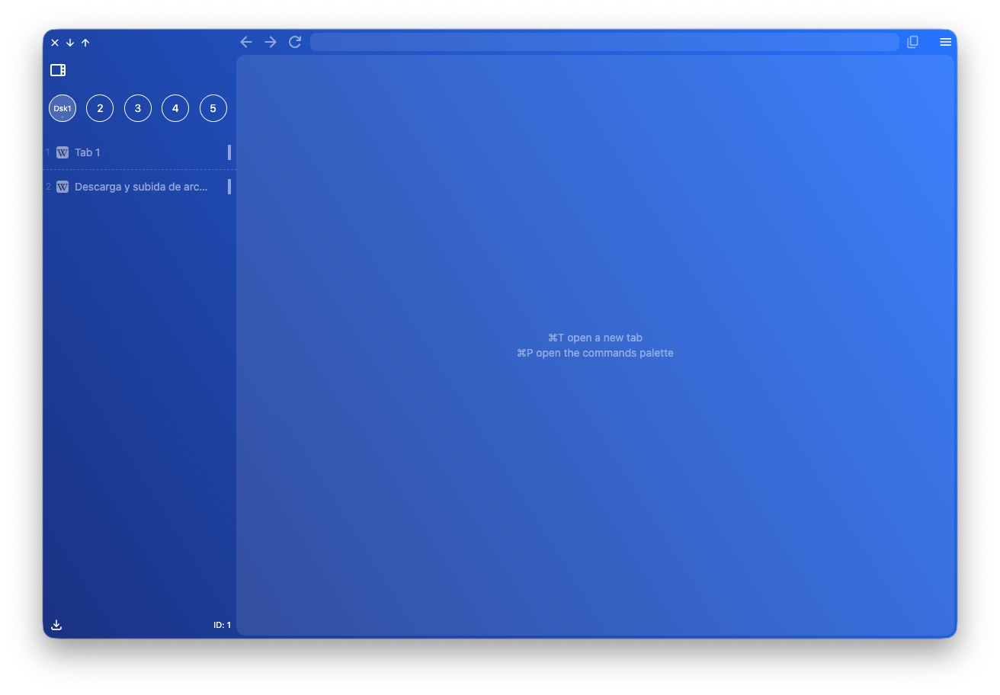
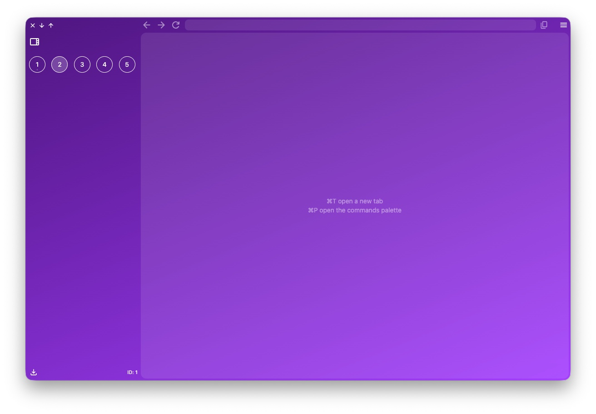
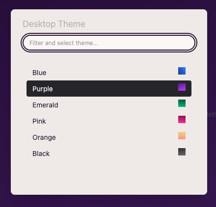

import FeatureAccess from '../../../../components/FeatureAccess.astro'

Los temas visuales de los escritorios te permiten asignar un tema diferente a cada uno de ellos para poder diferenciarlos más fácilmente.

Por ejemplo, puedes tener el tema azul en el escritorio 1 y el violeta en el 2.

<FeatureAccess entity="tema del escritorio" command="Desktop Theme" contextMenu="Change theme" />

Te aparece un modal con el listado de temas disponibles:

:::note
Recuerda que puedes modificar o añadir más temas en la [configuración](/es/config/themes/).
:::
