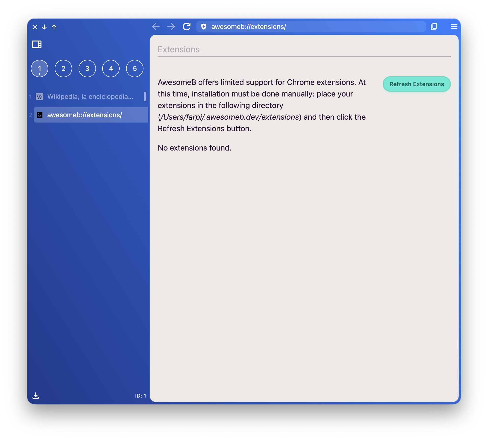
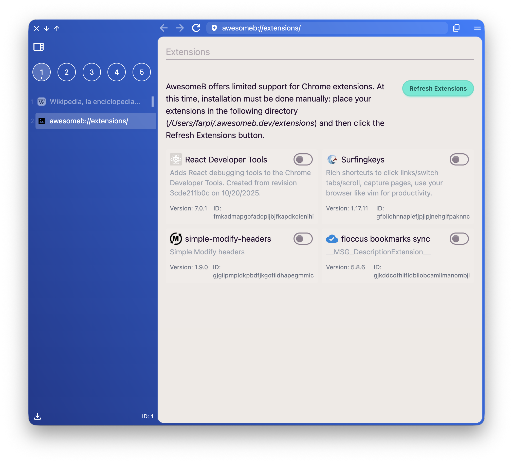
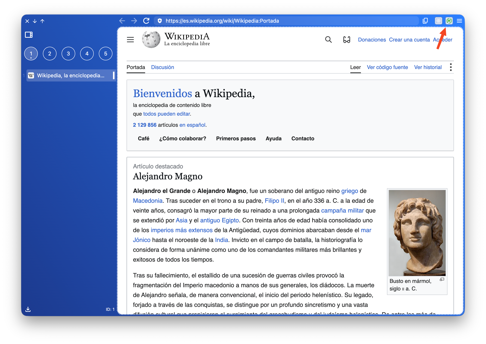

import FeatureAccess from '../../../../components/FeatureAccess.astro'

Como no hay una integración (todavía) con el *Chrome Store*, las extensiones se tienen que instalar manualmente.

<FeatureAccess entity="extensions" command="Manage Extensions" />

La primera vez que accedas a la página de gestión de extensiones solo verás esto:

Verás que el texto de ayuda te indica la ruta de tu carpeta de configuración, donde tienen que ir las extensiones.

Lo que tienes que hacer es bajarte la extensión con el navegador *Chrome*, localizar la carpeta y copiarla a la ruta donde te indica **AwesomeB**. Después solo tienes que pulsar el botón **Refresh Extensions**.

Por defecto las nuevas extensiones aparecen desactivadas. Activa las que necesites y al **abrir una pestaña** las verás en la barra superior.

:::note
Ten en cuenta que las extensiones van por **perfil**. Esto quiere decir que si una extensión guarda algún setting en el local storage y trabajas con múltiples perfiles, tendrás que acceder a la extensión y configurarla para cada uno de ellos.
:::
