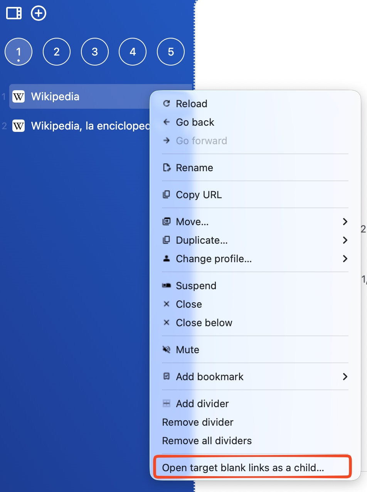
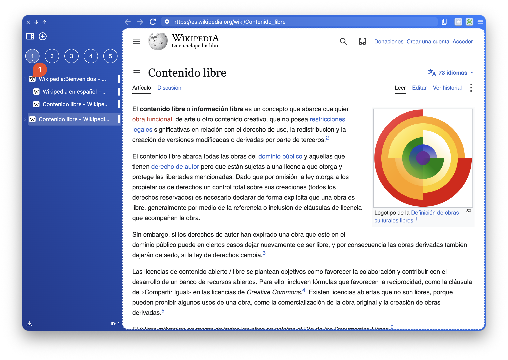
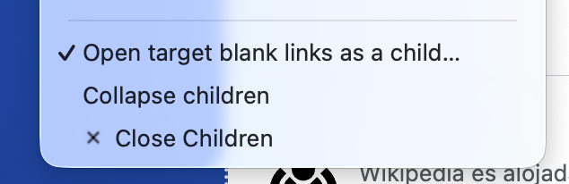
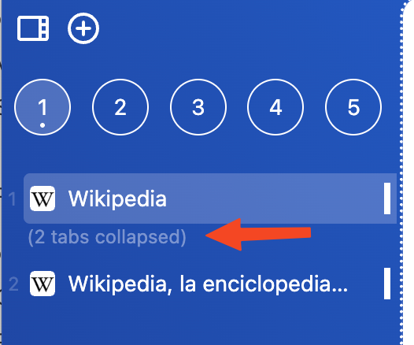

Imagina el siguiente escenario.

En el *sidebar* tienes tres pestañas: Jira, Pestaña 2, Pestaña 3. Jira abre todos los tickets como `target="_blank"`. Esto significa que se crearán nuevas pestañas al final, después de la Pestaña 3.

Esto es muy incómodo porque quedan pestañas desorganizadas y por eso existe la siguiente funcionalidad.

Abre el menú contextual y selecciona la opción **Open target blank links as a child...**.

A partir de ahora, todos los sitios web que se abran desde esta pestaña quedarán como hijas.

Esto te permite mover el padre arriba o abajo manteniendo las hijas relacionadas.

Además, también a través del menú contextual, tendrás la opción de cerrar todas las hijas o de colapsarlas.

Si están colapsadas, lo verás con un indicador:

