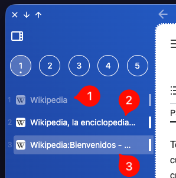
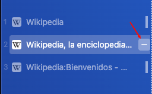
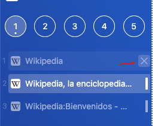
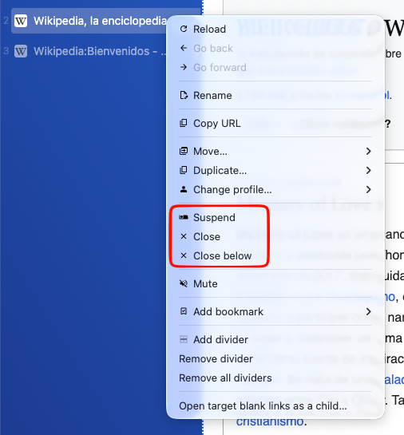

import FeatureAccess from '../../../../components/FeatureAccess.astro'

**AwesomeB** introduce una nueva manera de gestionar las pestañas: antes de cerrarlas, pasa por el estado de **suspenderlas**. Los escritorios organizan las pestañas según tu flujo de trabajo, y suspenderlas te permite mantenerlas en su sitio y recuperarlas más adelante.

En la captura anterior puedes ver una pestaña suspendida (1) y dos activas (2 y 3).

Hay varias formas de cerrar o suspender una pestaña:

## Suspender

<FeatureAccess entity="suspender una pestaña" macOS="Cmd+Shift+s" command="suspendTab" menu="tabs.suspend" />

También, cuando un sitio web está activo y pasas el ratón por encima, aparecerá un botón con el signo menos que significa **suspenderlo**.

## Cerrar

<FeatureAccess entity="cerrar una pestaña" macOS="Cmd+w" command="closeTab" menu="tabs.close" />

También, cuando un sitio web está suspendido y pasas el ratón por encima, aparece el botón de una X, que significa cerrarlo.

:::note
Ten en cuenta que cuando se cierra una pestaña, permanece oculta durante unos días ([mira la configuración](/es/config/general/#retenci%C3%B3n-de-las-pesta%C3%B1as-cerradas)) y es posible recuperarla.
:::

:::note
Las pestañas que se abren con el perfil **privado**, al cerrarlas, desaparecen permanentemente. No es posible reabrirlas.
:::

## Menú contextual

Utilizando el menú contextual encima de una pestaña, además de permitir suspenderla o cerrarla directamente, también te permite cerrar todas las pestañas por debajo de la actual.

