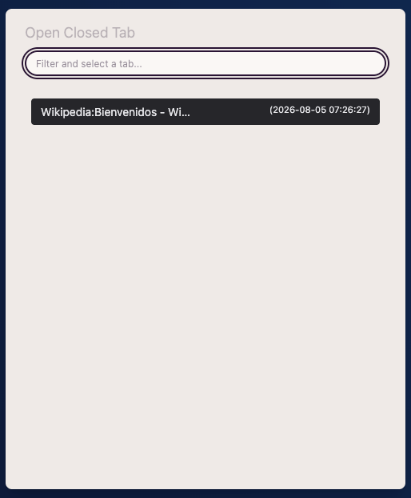
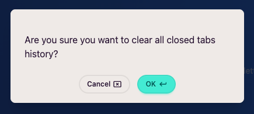

import FeatureAccess from '../../../../components/FeatureAccess.astro'

Como ya se ha comentado en el [apartado anterior](/es/tabs/close/), cuando un sitio web se cierra, permanece invisible durante unos días por si quieres volver a abrirlo.

<FeatureAccess entity="reabrir una web" macOS="Cmd+Shift+t" command="Open Closed Tab" menu={['File', 'Open recently closed tab']} />

Si utilizas el comando, te aparecerá un modal para filtrar/seleccionar qué sitio web quieres reabrir.

## Limpiar pestañas cerradas

Si quieres limpiar el historial de todas las pestañas cerradas, puedes hacerlo a través del comando **Clear Closed Tabs**. Te pedirá confirmación antes de proceder:

