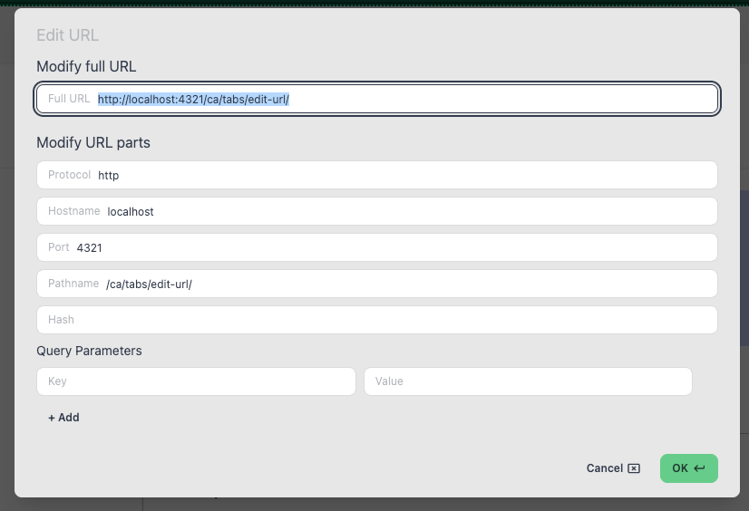

import FeatureAccess from '../../../../components/FeatureAccess.astro'

<FeatureAccess entity="editar la URL" shortcut="editUrl" command="editUrl" menu="edit.editUrl" />

También podrás editarla haciendo clic sobre la barra de direcciones. Sé que el comportamiento no es el esperado, ya que normalmente esperarías un campo de texto libre.

Verás un modal con dos opciones de modificación:

1. **Modificación simple**: cambias o pegas la nueva URL.
2. **Modificación compleja**: la URL está dividida en partes, permitiéndote modificar solo la parte que desees. También puedes añadir o modificar los *queryparams*.

## Pegar y ir

<FeatureAccess entity="pegar y ir" command="tabNewFromClipboard" menu="file.pasteAndGo" />
