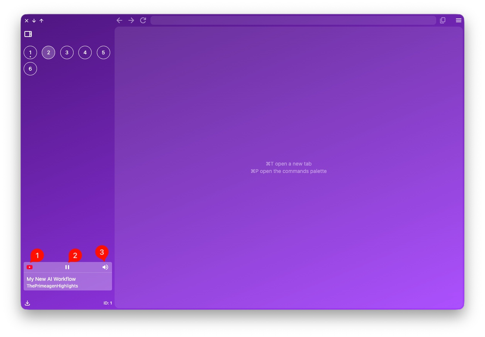

Si estás en un sitio web que contiene un *MediaSession*, por ejemplo *Youtube*, y te vas a otro, aparecerá el siguiente widget en la parte inferior del panel izquierdo (*sidebar*) el cual te permitirá gestionarlo.

1. Haciendo clic sobre el *favicon* volverás al sitio web que está reproduciendo el *MediaSession*.
2. Puedes pausar o reproducir el media.
3. Puedes mutear/desmutear el audio.
