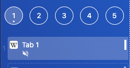

import FeatureAccess from '../../../../components/FeatureAccess.astro'

<FeatureAccess entity="mutear una pestaña" command="toggleMute" contextMenu="contextTab.mute" />

Si una pestaña está muteada, se indicará con un icono.

:::note
Cuando una pestaña esté muteada no requerirá nunca [atención](/es/tabs/navigate/#requiere-atenci%C3%B3n).
:::
