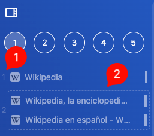
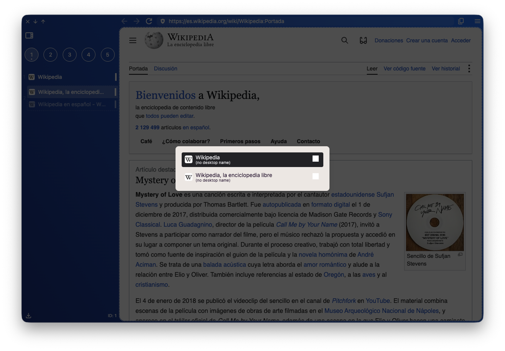
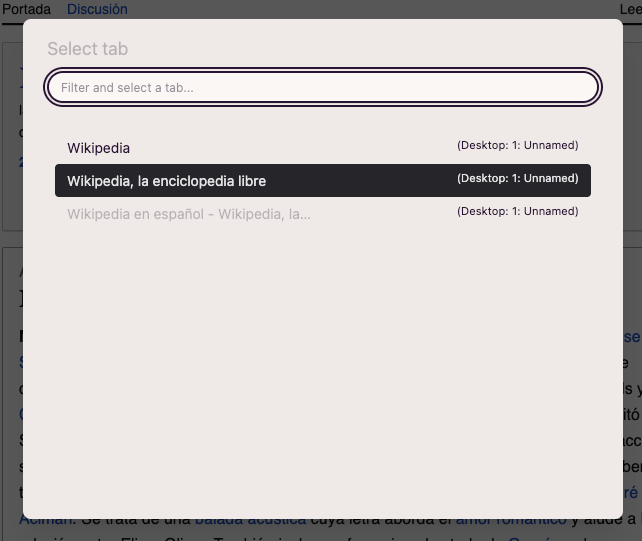
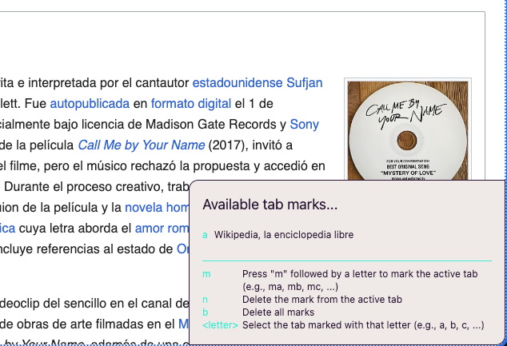
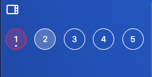
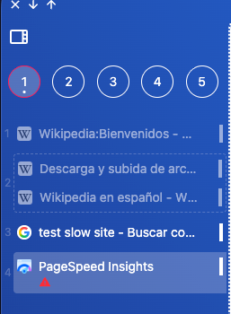

import FeatureAccess from '../../../../components/FeatureAccess.astro'

Aquí encontrarás las diferentes formas que tienes para navegar entre pestañas.

Antes de nada, necesitas conocer el concepto de **tab container**.

Un *tab container* es un contenedor que puede tener varias pestañas. Por ejemplo, si haces un *split* de dos sitios web (2), el *tab container* los contiene ambos (uno a la izquierda y el otro a la derecha).

Cada *tab container* está enumerado(1) entre el 1 y el 9. Este número/índice te permitirá navegar directamente a él con la combinación de teclas:

<FeatureAccess entity="acceder a la primera pestaña" shortcut="selectTab1" />

<FeatureAccess entity="acceder a la segunda pestaña" shortcut="selectTab2" />

... y así hasta la **9**.

:::note
Si accedes a una pestaña donde ya estás, volverás a la pestaña anterior. Por ejemplo: si estás en la pestaña 3, accedes a la 1 y vuelves a acceder a la 1, volverás a la 3.
:::

## Anterior/Siguiente

Si quieres moverte entre la pestaña anterior y la siguiente:

<FeatureAccess entity="pestaña anterior" shortcut="previousTab" />

<FeatureAccess entity="pestaña siguiente" shortcut="nextTab" />

:::note
Estas combinaciones son las de por defecto siempre y cuando tengas la configuración de `Generic ISO`.
:::

## Selector de pestañas

El *tab switcher* es el típico componente que te muestra un listado con las pestañas abiertas para navegar entre ellas.

<FeatureAccess entity="selector de pestañas" shortcut="tabSwitcher" />

:::note
Las pestañas están ordenadas por la hora del último acceso. Así podrás alternar fácilmente entre la pestaña actual y la última que has visitado.
:::

## Buscar una pestaña

Con la siguiente combinación de teclas te aparece un modal con todas las pestañas (activas y suspendidas):

<FeatureAccess entity="buscar una pestaña" shortcut="findTab" />

## Marcas

**AwesomeB** introduce un sistema de marcas para acceder rápidamente a las pestañas que más utilizas.

Con el siguiente atajo aparece (abajo a la derecha) una pequeña caja de información:

<FeatureAccess entity="marcas" shortcut="tabMarks" />

Una vez abierta, puedes (sin dejar de pulsar `Cmd`):

* Pulsando `m+<letra>` creas una nueva marca asociando la letra a la pestaña que tengas activa.
* Pulsando `<letra>` solo la letra, accederás a la pestaña asociada.
* Pulsando `n` borrarás la marca de la pestaña activa.
* Pulsando `b` borrarás todas las marcas.

## Requiere atención

Si estás en un escritorio (por ejemplo el 2) y en el 1 hay una pestaña que requiere atención, el escritorio se mostrará en rojo.

Pulsando el siguiente atajo irás directamente a la pestaña:

<FeatureAccess entity="pestaña que requiere atención" shortcut="selectTabAttention" />

La pestaña afectada tendrá un icono de alerta, en rojo.

:::note
Estando en la pestaña que ha requerido atención, si vuelves a pulsar el mismo atajo volverás a la pestaña previa de donde venías.
:::

:::note
Una pestaña que requiere atención significa que ha cambiado su *favicon*, título o ha emitido un sonido.
:::

## Alternar

También hay una combinación de teclas específica para alternar rápidamente (sin utilizar el tab switcher) entre la última pestaña utilizada:

<FeatureAccess entity="la anterior pestaña visitada" shortcut="previousVisited" />
