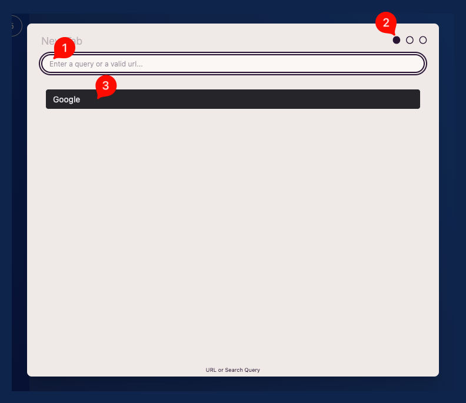
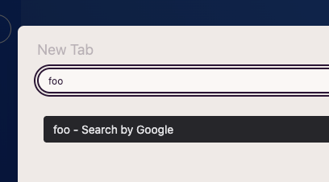
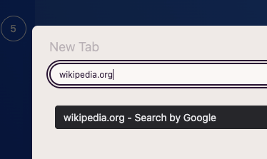
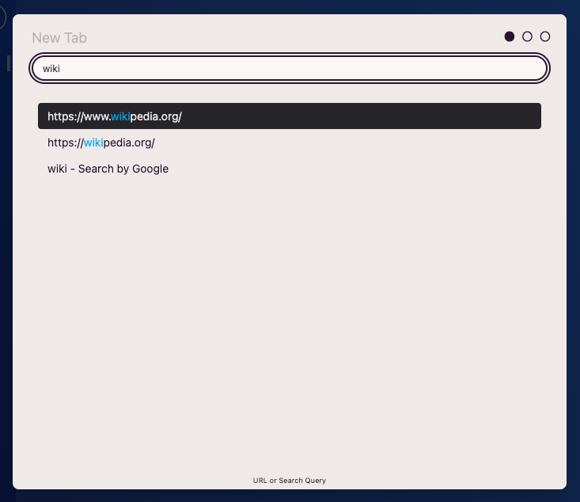
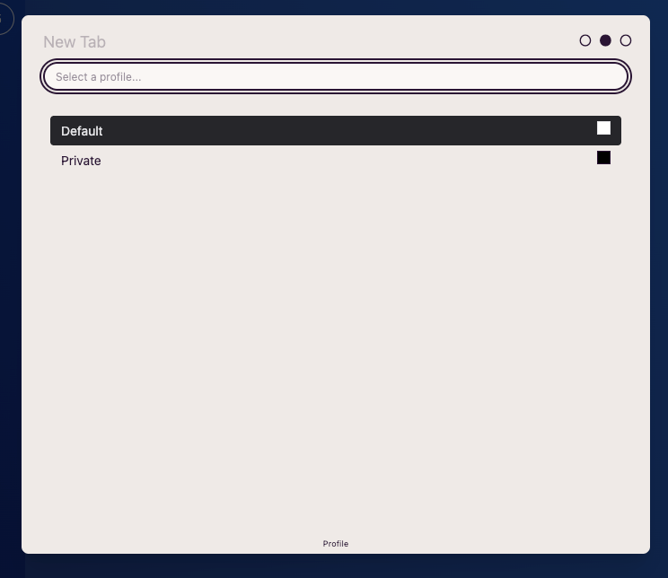
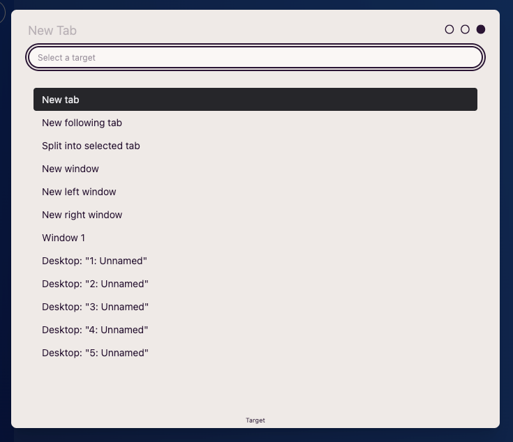
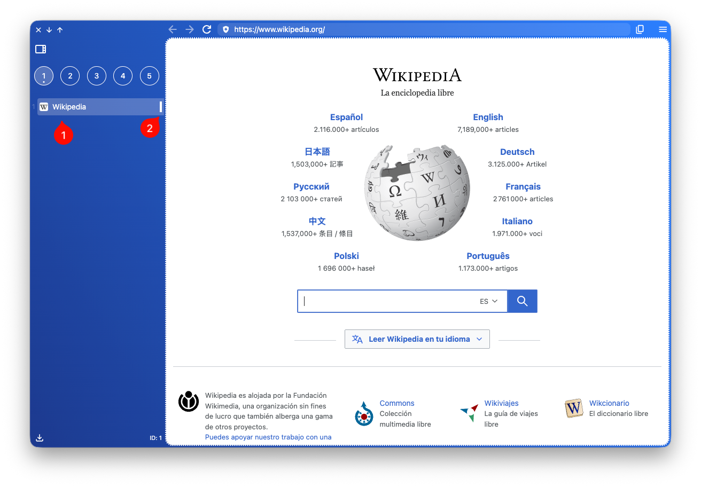

import FeatureAccess from '../../../../components/FeatureAccess.astro'

<FeatureAccess entity="nueva pestaña" macOS="Cmd+t" command="New Tab" />

Verás un modal como este:

Donde:

1. Es un campo de texto donde podrás introducir:
    * Cualquier cadena de texto para buscarla a través de uno de los buscadores configurados.
    * Un dominio válido.
    * Buscar en el historial de navegación.
2. Indicador de páginas:
    * Página 1: Buscar.
    * Página 2: Selección de perfil.
    * Página 3: Selección del target.
3. Listado con:
    * Selección de buscadores configurados.
    * Selección de un elemento del historial de navegación.

## Utilizar un buscador

Para utilizar uno de los buscadores [configurados](/es/config/general/), deberás introducir el texto que quieres buscar (1), seleccionar el buscador deseado y pulsar enter.

:::note
Si quieres navegar al anterior o siguiente elemento de la lista rápidamente, podrás utilizar las combinaciones: **Shift+j** / **Shift+k** / **Arrow Up** / **Arrow Down**.
:::

## Introducir un dominio válido

También podrás introducir un dominio válido (no es necesario añadir el protocolo) y pulsar enter.

## Utilizar el historial

Cuando escribas una cadena de texto, **AwesomeB** buscará también en el historial y mostrará los resultados en la lista. Podrás seleccionar uno y pulsar enter.

## Seleccionar un perfil

Como has visto en la [configuración](/es/config/profiles/) es posible tener varios perfiles. Para abrir una nueva pestaña con un perfil distinto al **default**, deberás pulsar la tecla **Tab** para pasar a la siguiente página. Allí podrás seleccionar el perfil deseado.

## Selección del target

Finalmente, si lo deseas, volviendo a pulsar **Tab** podrás acceder a la tercera página, la cual te permitirá seleccionar dónde quieres abrir la nueva pestaña:

Las opciones disponibles son:

* **New tab**: Abre el sitio web en una nueva pestaña al final del listado de pestañas.
* **New following tab**: Si ya tienes otra pestaña previa seleccionada, abre el nuevo sitio web justo después de esta.
* **Split into selected tab**: Abre el nuevo sitio web en una pantalla dividida junto con el sitio web previo que tuvieses seleccionado.
* **New window**: Abre el sitio web en una nueva ventana.
* **New left window**: Útil si tienes una pantalla a la izquierda. Abrirá el nuevo sitio web en una nueva ventana situada en la pantalla de la izquierda.
* **New right window**: Útil si tienes una pantalla a la derecha. Abrirá el nuevo sitio web en una nueva ventana situada en la pantalla de la derecha.
* **Window 1**: Abre el nuevo sitio web en una pestaña en la ventana 1. Este elemento es dinámico. Esto quiere decir que si tuvieses dos ventanas, verías las opciones "Window 1" y "Window 2".
* **Desktop 1, 2, ...**: Abre el nuevo sitio web en el escritorio indicado.

## Una vez abierta la nueva pestaña

Una vez hayas abierto la nueva pestaña, la verás en el listado del sidebar de la izquierda, donde encontrarás el *favicon* y el título (1) y un indicador con el color del perfil con el que se ha abierto (2).
