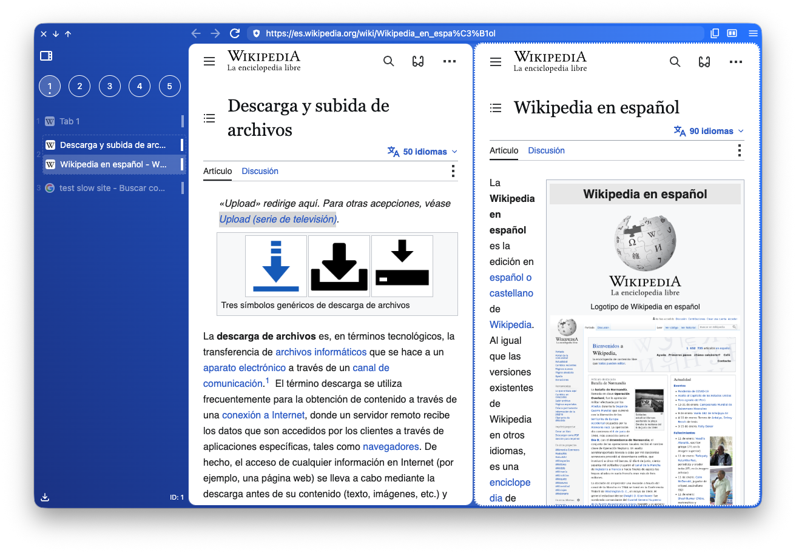
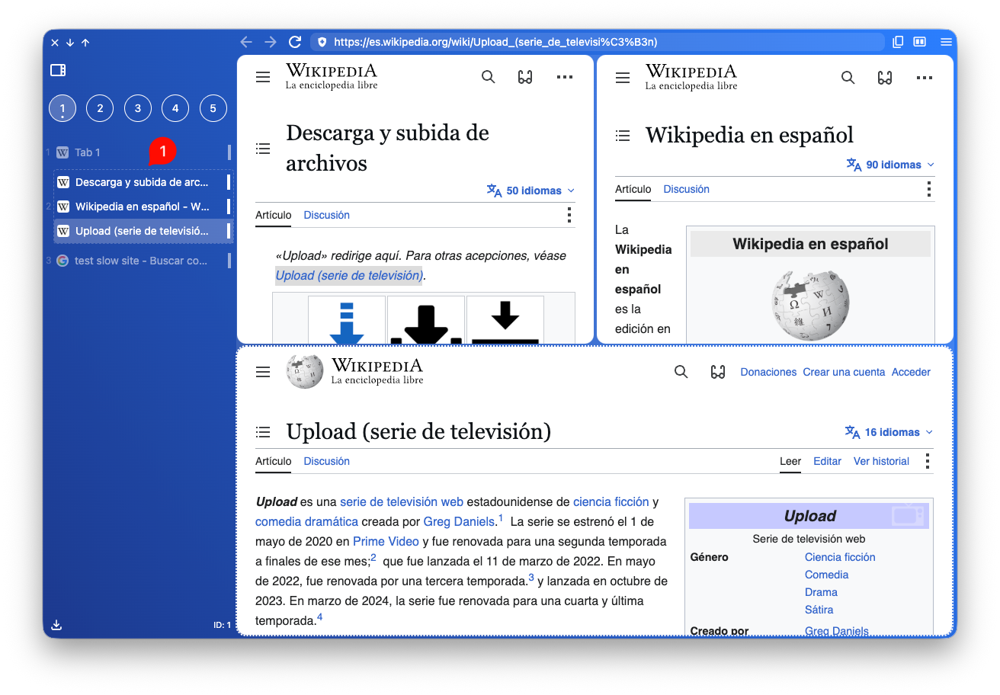
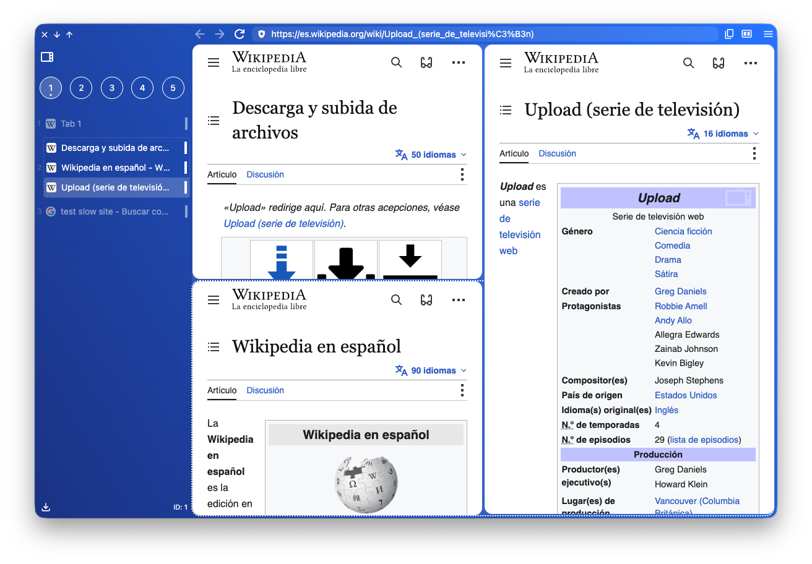
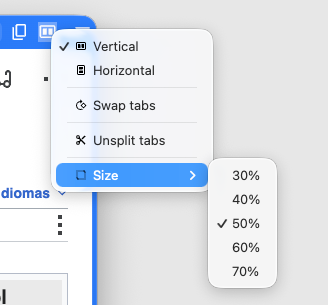

Se pueden abrir hasta **tres** pestañas en formato dividido (en un mismo *tab container*).

:::note
Cuando un *tab container* contiene más de una pestaña, se muestra un marco rayado (1).
:::

Además, actualmente hay dos formatos, el horizontal y el vertical.

## Cambiar disposición o tamaño

Cuando hay pestañas divididas, en la barra superior aparece el icono para desplegar el menú de opciones.

Allá podrás:

* Cambiar el formato (horizontal, vertical).
* Rotar las pestañas hacia la derecha.
* Separar las pestañas en pestañas individuales.
* Cambiar el tamaño. También existe el comando `Change Layout Size`.

:::note
Actualmente el tamaño solo se puede cambiar a través del menú. No existe la funcionalidad de *drag & resize*. Posiblemente existirá en el futuro.
:::
