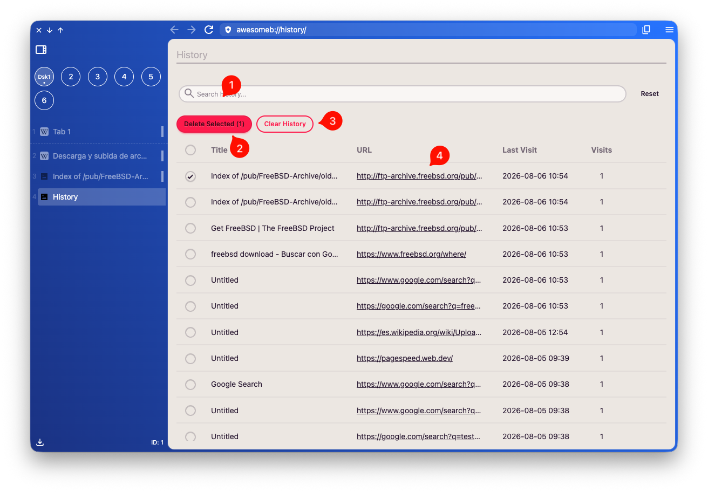

import FeatureAccess from '../../components/FeatureAccess.astro'

<FeatureAccess entity="history" command="Manage history"  />

1. You can search in the history
2. Delete certain selected items
3. Clear all history
4. Click on one of their links

:::note
Remember that from the [configuration](/config/general/#history-retention) you can specify how long history is kept.
:::
