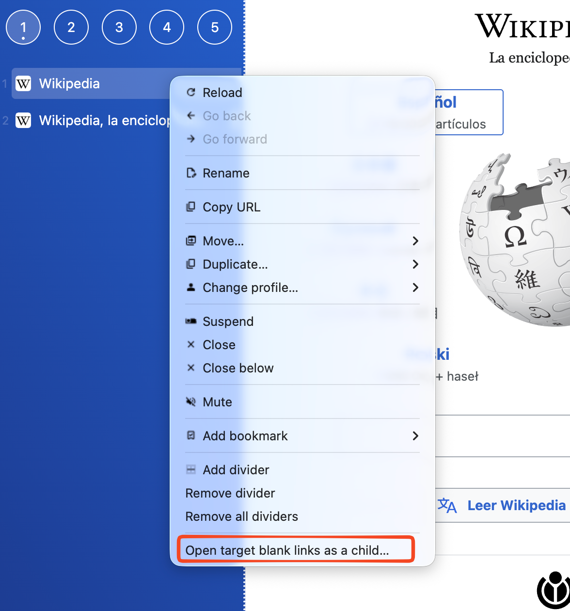

Imagine the following scenario.

In the *sidebar* you have three tabs: Jira, Tab 2, Tab 3. Jira opens all tickets as `target="_blank"`. This means new tabs will be created at the end, after Tab 3.

This is very inconvenient because the tabs end up disorganized, and that's why the following feature exists.

Open the context menu and select the option **Open target blank links as a child...**.

From now on, all websites that open from this tab will become children.

This lets you move the parent up or down while keeping the children linked.

You can also use the context menu to close all children.

