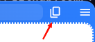

import FeatureAccess from '../../../components/FeatureAccess.astro'

<FeatureAccess entity="copy URL" macOS="Cmd+Shift+c" command="Copy URL" contextMenu="Copy URL" menu={['Edit', 'Copy URL']}/>

You can also access it through the button on the right of the URL:

Once copied, you'll see a system notification showing the copied URL.
