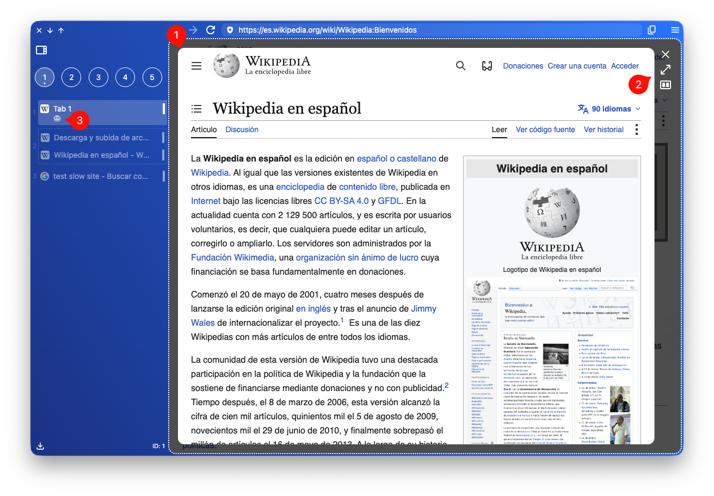

While you browse a website and find a link, you'll often want to preview it before opening it as a new tab.

To preview it:

* macOS: `Opt+<click>`

A new view will appear inside the same tab with the website's preview (1). From there, you can navigate to decide whether to dismiss it or not.

Below the tab's title, you'll see an eye icon (3), which indicates that this tab has a preview open.

You have three available actions (2):

* Click the cross or press `esc` to dismiss it.
* Click the maximize arrows or press `enter` to open it as a new tab.
* Click the split icon to open the link in [split view](/tabs/split/).
